# AWS Serverless Order Processing

Projeto final do **Programa AWS Developer** da Escola da Nuvem, implementando um sistema de processamento de pedidos **orientado a eventos** usando serviços totalmente gerenciados da AWS.

Arquitetura principal:
- Entrada de pedidos via **API Gateway** e via **arquivos S3**
- Validação com **AWS Lambda**
- Processamento assíncrono com **SQS FIFO/Standard**
- Orquestração com **EventBridge**
- Persistência em **DynamoDB**
- Alertas de erro via **SNS**
- Resiliência com **DLQs**
- Infraestrutura como Código com **CloudFormation**

---

## 🧱 Arquitetura Geral
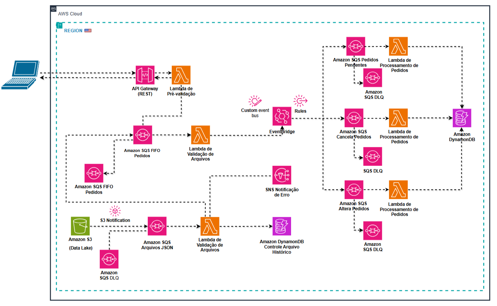

---

## 📌 Ingestão de Pedidos via API e EventBridge

**Componentes:**
- API Gateway (rota `/pedidos` POST)  
- Lambda de pré-validação  
- Fila SQS FIFO  
- EventBridge Custom Bus  

**Diagrama e prints:**

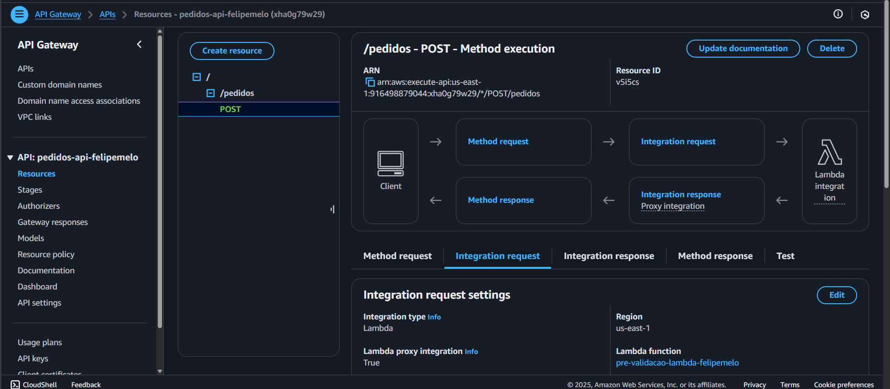  
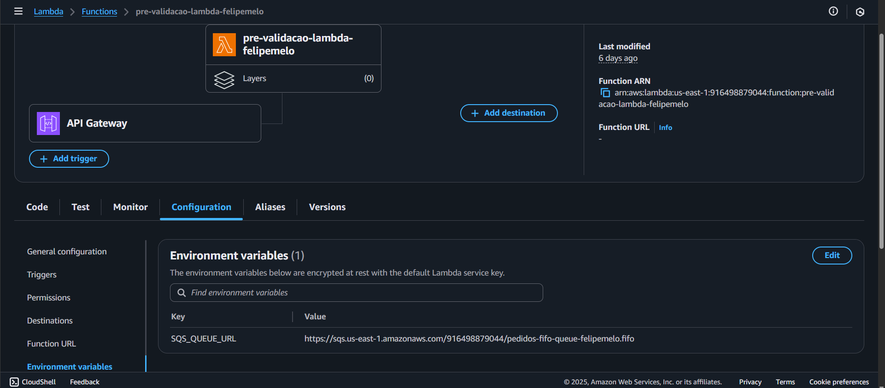  
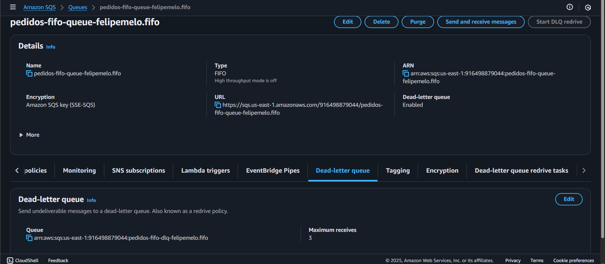  
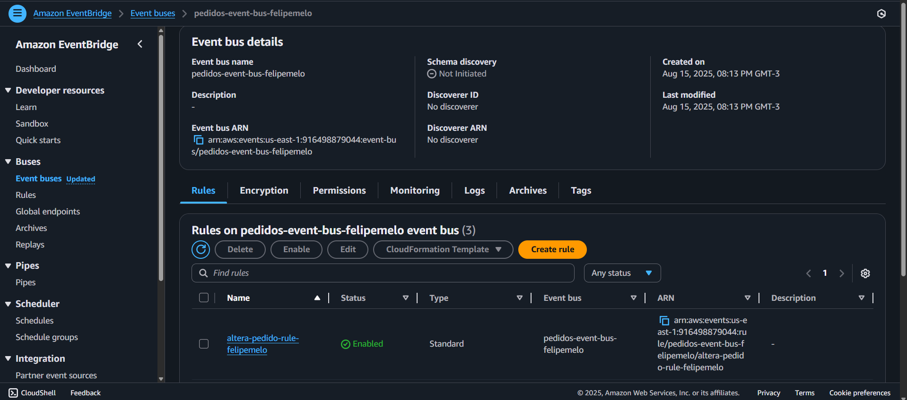  

---

## 📌 Ingestão de Arquivos via S3 e Rastreamento

**Componentes:**
- Bucket S3 recebendo arquivos `.json`  
- DynamoDB para histórico  
- SNS notificando falhas  
- Lambda de validação com variáveis de ambiente  

**Diagrama e prints:**

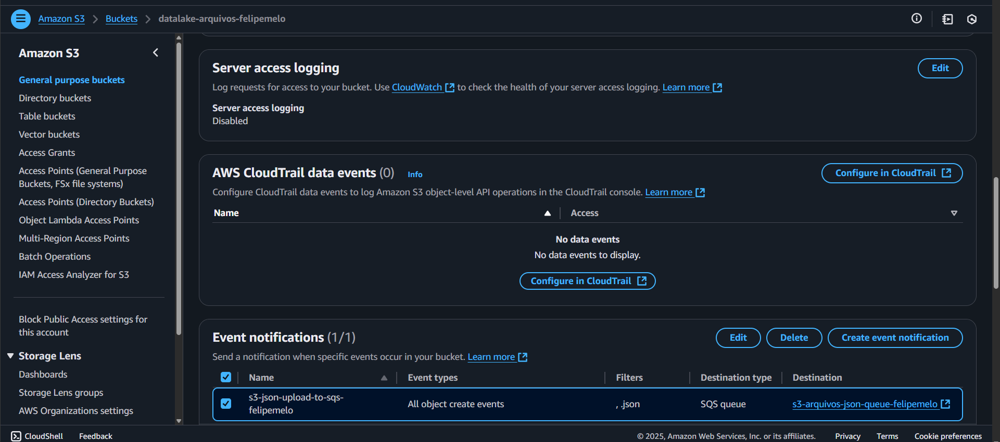  
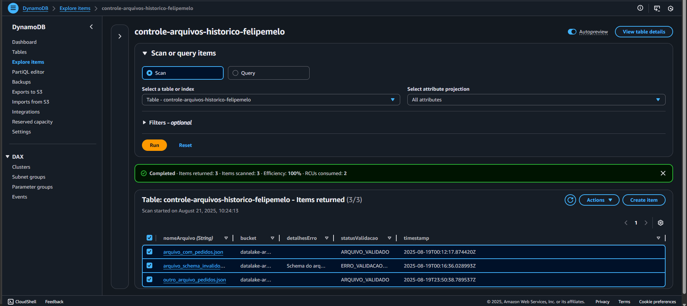  
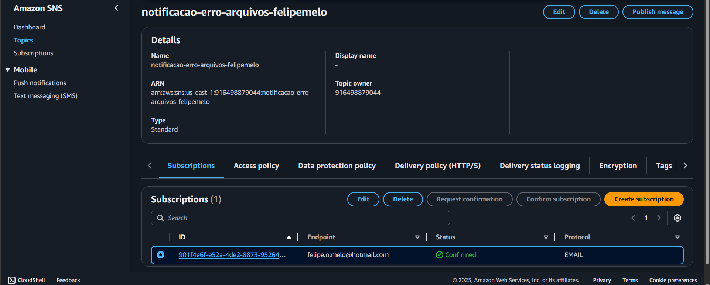  
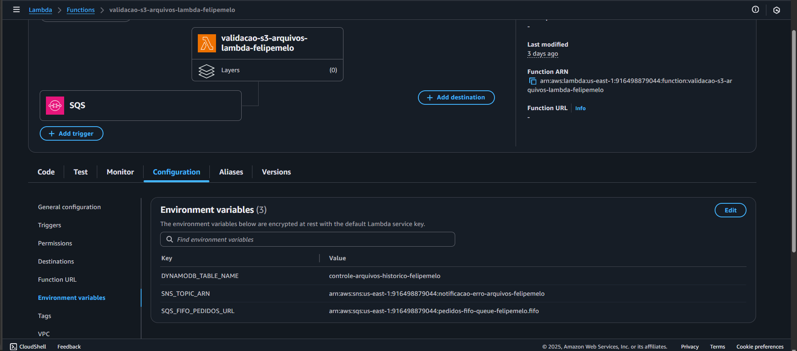  

---

## 📌 Processamento Central e Persistência

**Componentes:**
- EventBridge Rule para roteamento de pedidos validados  
- SQS Pedidos Pendentes  
- Lambda Processa-Pedidos  
- DynamoDB com pedidos processados  

**Diagrama e prints:**

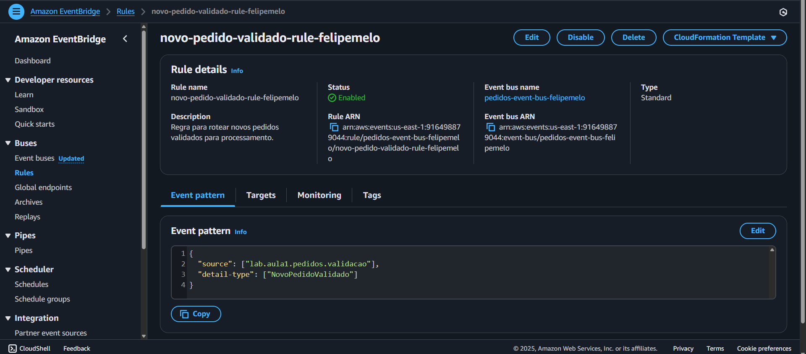  
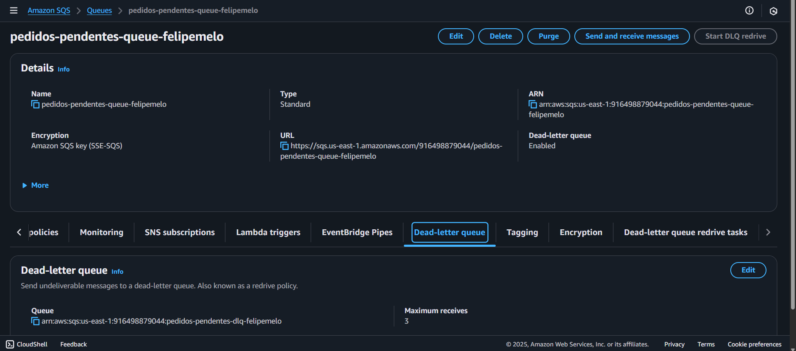  
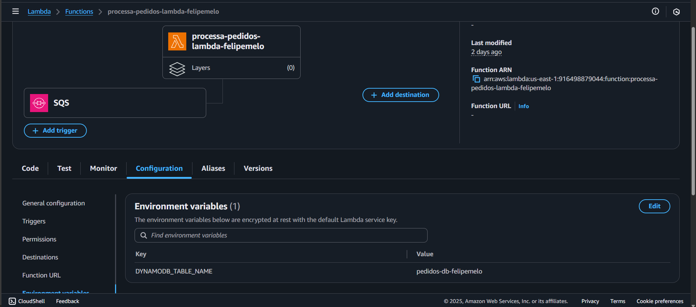  
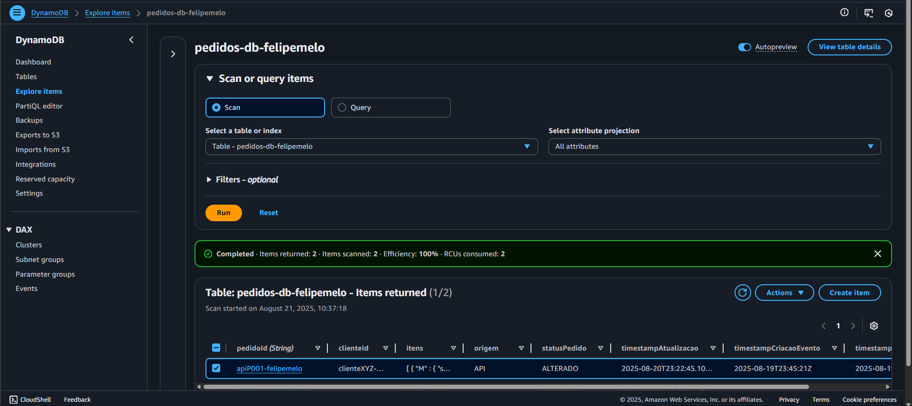  

---

## 📌 Cancelamento e Alteração + DLQs

**Componentes:**
- EventBridge Rules CancelarPedido e AlterarPedido  
- Filas SQS específicas (com DLQs)  
- Lambdas para cancelar ou alterar pedidos  
- DynamoDB refletindo status alterado/cancelado  

**Diagrama e prints:**

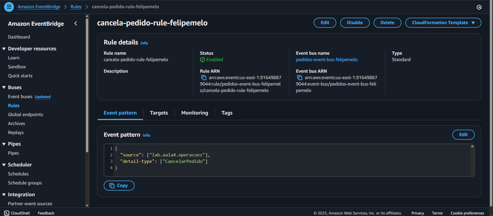  
  
  
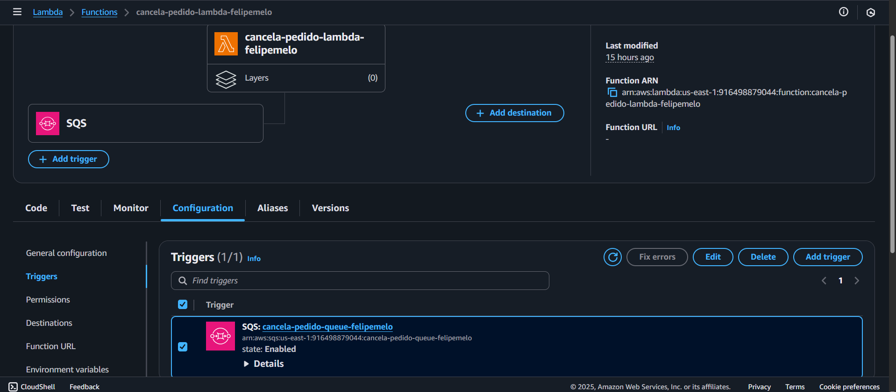  
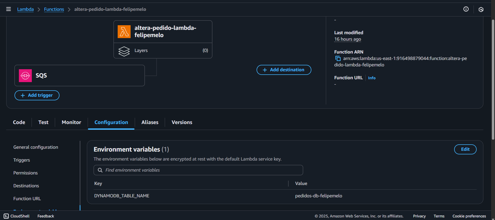  

---

## ✅ Prova de Funcionamento

- Pedido recebido via EventBridge → SQS  
- Processamento pela Lambda  
- Persistência no DynamoDB (`PEDIDO_PROCESSADO`)  

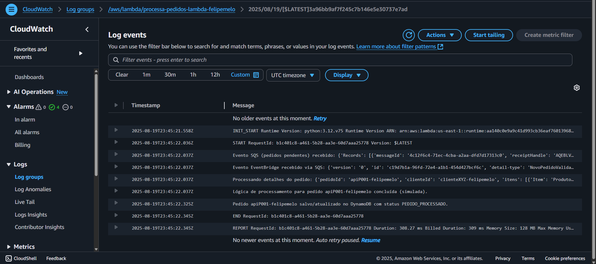
